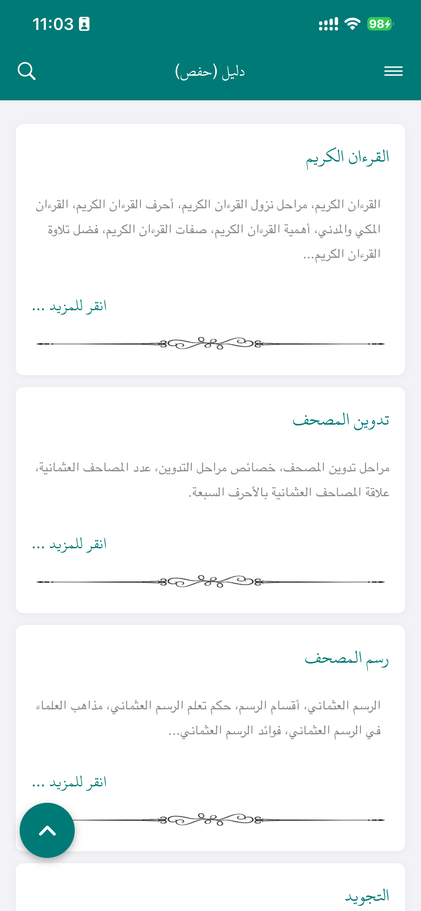
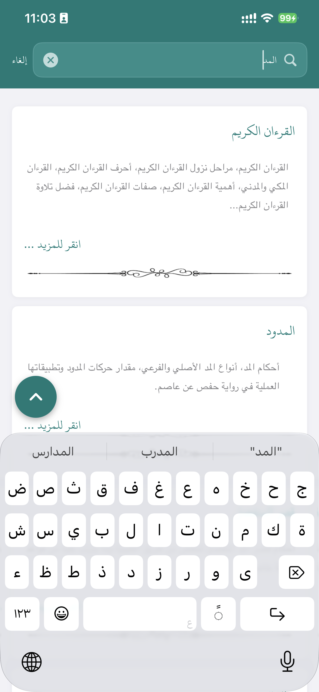
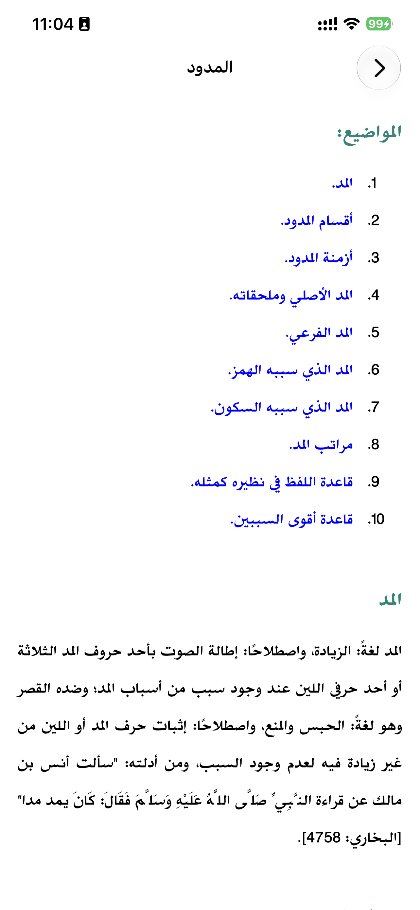
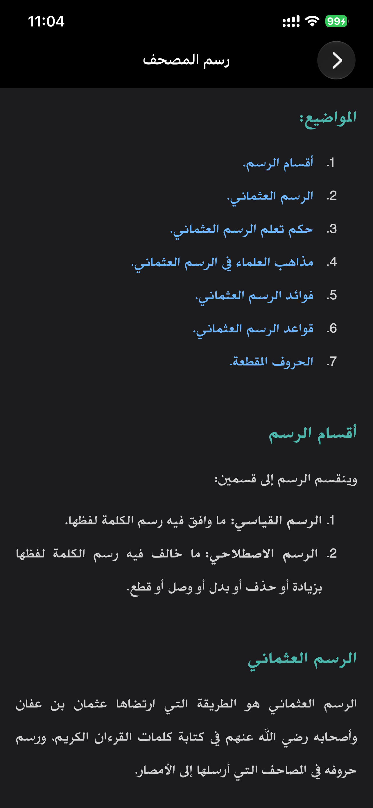
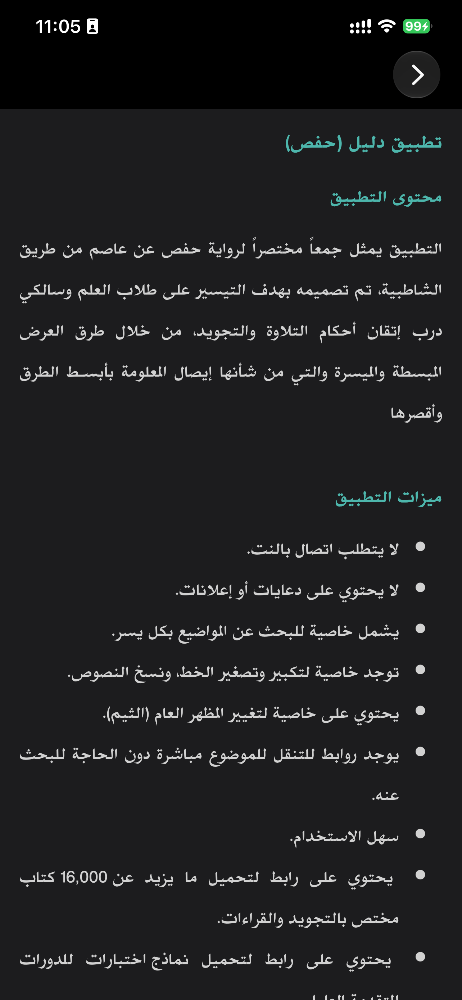

# دليل حفص — Daleel Hafs

An independent iOS application for learning and studying Tajweed, Qur’an reading, and related Arabic rules.

## About the project

دليل حفص (Daleel Hafs) is an iOS application designed to make educational material related to Qur’an reading, Tajweed, and Arabic rules more accessible on Apple devices.

According to the project maintainer, the project was created after discovering that the original Daleel Hafs experience was available primarily as an older Android application, with no modern iOS equivalent available. This project aims to provide an iOS-native experience for people who want to access the same type of educational material on iPhone and iPad.

The application includes a collection of educational books and resources covering topics related to:

- Tajweed
- Qur’an reading
- Arabic pronunciation and recitation rules
- Hafs recitation
- Related Arabic linguistic and religious study materials

## Project status

This project is under development and is shared publicly through GitHub for educational, community, and personal use.

The application is not currently distributed through the Apple App Store.

The goal is to make the project available to the community while respecting and acknowledging the work of the original creator of the Android application that inspired it.

## Features

- Native iOS application built with SwiftUI
- Right-to-left Arabic interface support
- Searchable collection of Tajweed and Qur’an-related educational books
- Local, offline reading experience using bundled HTML content
- Light and dark appearance support for the reader
- Illustrations and bundled pronunciation audio clips in the educational material
- A simple, focused reading interface for iPhone and iPad

## Technology

The application is built using:

- Swift
- SwiftUI
- WebKit for displaying local educational HTML content
- Xcode and native iOS frameworks

## Getting started

1. Open `دليل  حفص.xcodeproj` in Xcode.
2. Select the `دليل  حفص` target.
3. Configure code signing and replace the placeholder bundle identifier if necessary.
4. Build and run on an iPhone or iPad simulator, or on a signed device.

The project targets iOS 26.0 and uses Swift 5. It has no third-party package-manager dependencies.

### Content maintenance

Educational articles, media, fonts, and styles are bundled in `Resources/`. To add or update a topic, keep the HTML resource filename aligned with its `Book` entry in `دليل  حفص/ContentView.swift` and ensure the resource is included in the application target.

Arabic filenames can differ only in Unicode normalization, particularly around diacritics. Preserve existing filenames carefully and verify resource loading after changes.

## Screenshots

  
  
  

  
  

## Attribution and copyright

This project was inspired by the original Daleel Hafs / دليل حفص Android application and its educational content.

The original application and its materials may be owned by their respective creators and copyright holders. This iOS project does not claim ownership of the original work, and it is not intended to suggest a transfer of ownership, permission, endorsement, or affiliation.

The maintainer states that they have attempted to contact the original creator to discuss the iOS implementation and the possibility of collaboration, ownership transfer, or official distribution. At the time this README was written, no response had been received. This statement is not a claim that permission or a license has been granted.

If you are the original creator or copyright holder of the original Daleel Hafs application or its content, please contact the maintainer through this repository. The maintainer welcomes discussion of attribution, collaboration, ownership, licensing, or necessary changes to the project.

## Disclaimer

This repository is an independent iOS project. It is not officially affiliated with, endorsed by, or sponsored by the original creator of the Android application unless that relationship is explicitly stated in writing.

Any original application, educational text, images, audio, fonts, and other materials included or referenced in this repository may be subject to rights held by their respective owners. The repository does not establish that those materials are free to redistribute, modify, or use commercially.

If you believe that any content should be removed, modified, credited differently, or is used without appropriate authorization, please open a GitHub issue or contact the maintainer so the matter can be reviewed and addressed.

## Contributing

Contributions, corrections, improvements, and suggestions are welcome.

1. Fork the repository.
2. Create a feature branch.
3. Make your changes.
4. Submit a pull request.

For larger changes, opening an issue first is recommended.

## Contact

If you are the original creator of Daleel Hafs or have information regarding the original application and its content, please open an issue in this repository or contact the maintainer through GitHub.

## License

No license file is currently included in this repository. The licensing status of the repository and its contents is under review because it contains educational material originating from or inspired by an existing application.

Until the licensing status is clarified, do not assume that any material in this repository—including source code, educational content, images, audio, or fonts—may be freely redistributed, commercially used, or republished. Any future license for source code created specifically for this iOS implementation will be stated explicitly and may not apply to bundled content.
